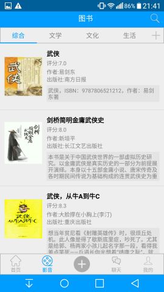
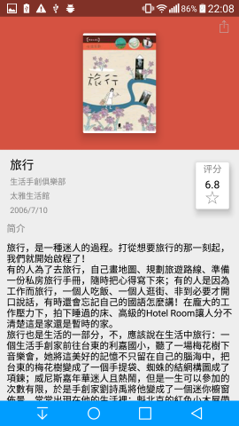
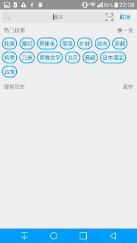

> 此app仅供学习参考，不作为商业用途，数据来源知乎和豆瓣

## OneDaily(还没想好一个好听的名字)

* 此app为阅读类app，分三个部分：
    1. 仿知乎日报
    2. 使用豆瓣图书API展示图书，提供综合，文学，文化，生活四个类型的图书展示（后续提供更改类型功能）。
    此外还可以搜索图书，有扫条码和输入书名两种方式。
    3. 添加查看笔记。

* 使用现在最流行的MVP+RxJvaa+Retrofit。用butterknif注解，使用glide进行图片展示。

* 界面风格采用Material Design设计规范.

### 首页

          

### 影音

 

### 笔记

  

### 使用到的开源库

* RxJava、Retrofit2、okhttp3、Butterknife、Glide、Gson

